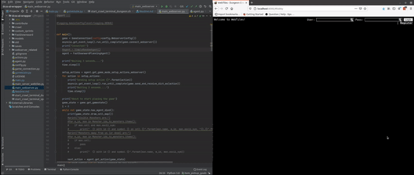
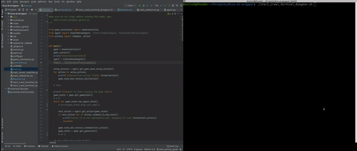

[](https://dcss-ai-wrapper.readthedocs.io/en/latest/?badge=latest)

# AI Wrapper for Dungeon Crawl Stone Soup



(Demo of an agent taking random actions to play DCSS in the browser using the docker container running a DCSS webserver instance)



(Demo of an agent taking random actions to play DCSS in the terminal)

# About

**dcss-ai-wrapper** is an API for Dungeon Crawl Stone Soup for Artificial Intelligence research. This effort started with the following paper: 

###Papers:

- *Dannenhauer, D., Dannenhauer, Z. A., Decker, J., Amos-Binks, A., Floyd, M., Aha D. W. [dcss ai wrapper: An API for Dungeon Crawl Stone Soup providing both Vector and Symbolic State Representations.](https://prl-theworkshop.github.io/prl2021/papers/PRL2021_paper_24.pdf) PRL Workshop - Bridging the Gap Between AI Planning and Reinforcement Learning. International Conference on Automated Planning and Scheduling (ICAPS). 2021.*

- *Dannenhauer, D., Floyd, M., Decker, J., Aha D. W. [Dungeon Crawl Stone Soup as an Evaluation Domain for Artificial Intelligence.](https://arxiv.org/pdf/1902.01769) Workshop on Games and Simulations for Artificial Intelligence. Thirty-Third AAAI Conference on Artificial Intelligence. Honolulu, Hawaii, USA. 2019.*

If you use this repository in your research, please cite the most recent paper.

###Tutorials:

- *[ICAPS 2021 Tutorial](https://dcss-ai-wrapper.readthedocs.io/en/latest/tutorials/icaps2021tutorial.html)*

If you'd like to contribute to the research effort aligned with this project, see [Research Effort](contribute/ResearchEffort.md) and [Roadmap](contribute/Roadmap.md)

# Development Community

Join the chat at https://gitter.im/dcss-ai-wrapper/community

Checkout the YouTube channel for live coding streams and tutorial videos (more content to come soon): https://www.youtube.com/channel/UCPR_UzIThpHNGEZos1SVmLQ 

# Quickstart

See the [Quickstart](https://dcss-ai-wrapper.readthedocs.io/en/latest/usage/quickstart.html) instructions on the documentation webpage.

# Quickest way to use API 

Example usage to create your own agent and run it:

```python
from dcss.agent.base import BaseAgent
from dcss.state.game import GameState
from dcss.actions.action import Action
from dcss.websockgame import WebSockGame
from dcss.connection.config import WebserverConfig

import random

class MyAgent(BaseAgent):

    def __init__(self):
        super().__init__()
        self.gamestate = None

    def get_action(self, gamestate: GameState):
        self.gamestate = gamestate
        # get all possible actions
        actions = Action.get_all_move_commands()
        # call your planner or policy instead of random: 
        return random.choice(actions)

def main():
    my_config = WebserverConfig

    # set game mode to Tutorial #1
    my_config.game_id = 'tut-web-trunk'
    my_config.tutorial_number = 1

    # create game
    game = WebSockGame(config=my_config,
                      agent_class=MyAgent)
    game.run()
```

# Building the documentation

Make sure the library is installed or autodoc may complain:

    python
    >>> import dcss

If you get a module not found error, install locally, for example:

    cd dcss-ai-wrapper/
    python -m pip install -e .

#### Option 1:

Build the api documentation by:

    sphinx-apidoc -f -o docs/api/ src/dcss/

On windows, use the make.bat script to create the html files:

    .\docs\make.bat html
    
Then open `docs/_build/html/index.html` in your browser to view the documentation.

##### If getting errors when building docs

Try two things: (1) make clean, like:

    .\docs\make.bat clean

and also remove all files in the `docs/api/` folder before doing

    sphinx-apidoc -f -o docs/api/ src/dcss/

and then finally run make to generate the html

    .\docs\make.bat html


#### Option 2:

Use sphinx-build from the root project directory like:

    sphinx-build  -v -b html docs/ docs/_build


If getting the following error:

    sphinx.errors.ExtensionError: Could not import extension autoapi.extension (exception: No module named 'autoapi')
    
then you may need to install autoapi like:

    pip install sphinx-autoapi


# Online Documentation

See the [online documentation](https://dcss-ai-wrapper.readthedocs.io/en/latest/) for more information.

